```mermaid
graph LR
    subgraph "Caption Confidence Gating"
        RGB[/"Spatial Features (512)"/] --> Concat[Concat]
        Cap[/"Caption Features (128)"/] --> Concat
        Concat --> MLP["MLP (Linear->ReLU->Linear)"]
        MLP --> Sigmoid["Sigmoid"]
        Sigmoid --> Sigma(("σ (Gate Weight)"))
        
        RGB --> Proj["RGB Projection (128)"]
        
        Sigma --> Fusion{Weighted Sum}
        Proj --> Fusion
        Cap --> Fusion
        
        Fusion --> Result[/"Fused Representation (128)"/]
    end
```

# REMA-Net: Technical Deep Dive

This document provides a detailed mathematical and structural explanation of the two primary enhancements: **Temporal Transformer** and **Caption Confidence Gating**.

---

## 1. Temporal Transformer Module

The Temporal Transformer replaces standard global average pooling over time. It allows the model to learn which frames in a sequence (e.g., 16 segments) are most important for defining an action.

### **Integration Path**
1. **Backbone**: Each frame passes through ResNet-18 to produce a spatial feature vector $x_i \in \mathbb{R}^{512}$.
2. **Positional Encoding**: To preserve the order of time, we add a sinusoidal positional encoding ($PE$) to the sequence.
3. **Self-Attention**: The transformer learns long-range dependencies between frames (e.g., the hand "wind-up" and the "release" in a throw).

### **Mathematical Formulation**

**Positional Encoding ($PE$):**
For each position $pos$ and dimension $i$:
$$ PE_{(pos, 2i)} = \sin\left(\frac{pos}{10000^{2i/d_{\text{model}}}}\right) $$
$$ PE_{(pos, 2i+1)} = \cos\left(\frac{pos}{10000^{2i/d_{\text{model}}}}\right) $$

**Self-Attention Mechanism:**
The core of the Transformer is Scaled Dot-Product Attention:
$$ \text{Attention}(Q, K, V) = \text{softmax}\left(\frac{QK^T}{\sqrt{d_k}}\right)V $$
Where $Q$ (Query), $K$ (Key), and $V$ (Value) are linear projections of the input sequence.

### **Structural Diagram**

---

## 2. Caption Confidence Gating

This module manages the reliability of the semantic stream (captions). It ensures that noisy or irrelevant captions produced by the LLM backbone do not downgrade classification accuracy.

### **Integration Path**
Integrated within the `MATResNet` class, this module takes the outputs of the Spatial Stream and the Caption Stream and performs a weighted fusion.

### **Mathematical Formulation**

**1. Feature Alignment (Projection):**
Since RGB features $F_{rgb} \in \mathbb{R}^{512}$ and Caption features $F_{cap} \in \mathbb{R}^{128}$ have different dimensions, we first project the visual features:
$$ F_{rgb}' = W_p \cdot F_{rgb} + b_p, \quad \text{where } W_p \in \mathbb{R}^{128 \times 512} $$

**2. Gate Weight Generation ($\sigma$):**
The gating network $G$ estimates the confidence score by looking at the concatenation of raw features:
$$ \sigma = \text{Sigmoid}(W_2 \cdot \text{ReLU}(W_1 \cdot [F_{rgb} ; F_{cap}] + b_1) + b_2) $$
The result $\sigma \in [0, 1]$ represents the "trust" placed in the caption.

**3. Weighted Late Fusion:**
The final fused feature vector $F_{fused}$ is a dynamic interpolation:
$$ F_{fused} = \sigma \cdot F_{cap} + (1 - \sigma) \cdot F_{rgb}' $$

### **Structural Diagram**

---

## 3. System Integration Overview

The following diagram shows how these two modules fit into the overall 3-stream architecture.

